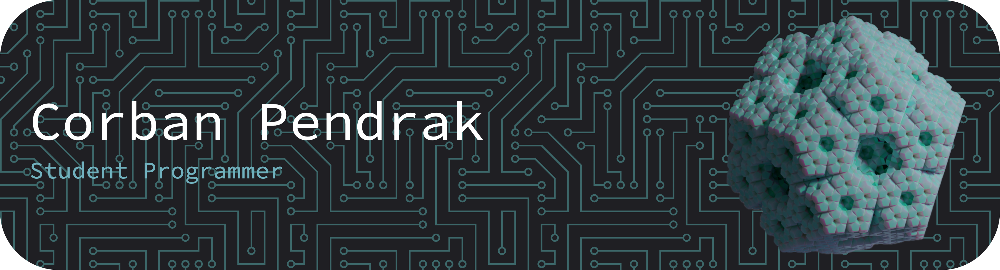

# Landing Page Repository

Hey everyone! This is the repo for my website, check it out!

# About Me

I am going into my sophmore year of college at [UCF](https://www.ucf.edu/), studying [Electrical](https://www.ucf.edu/degree/electrical-engineering-bsee/)/[Computer engineering](https://www.ucf.edu/degree/electrical-engineering-bsee/) with a side of cybersecurity. I am heavily involved in [Hack@UCF](https://hackucf.org/), vice president of [WikiKnights](https://wikiknights.com/), and to a lesser extent, [KnightHacks](https://github.com/knighthacks), [AI@UCF](https://github.com/ucfai), and [IEEE@UCF](https://www.ieeeucf.com/).

I enjoy learning and solving complex problems, optimizing systems, and experimenting with new technology. Knowledge alone isn’t useful; it requires wisdom to combine that knowledge with the appropriate circumstance to build something incredible.

## Interests

Among my many pursuits, I am primarily interested in rationality, [[Memory MOC|memory improvement]], [[Obsidian]], computer programming, [[Apple MOC|Apple development]], [[Web Development MOC|web development]], [[Artificial Intelligence MOC|artificial intelligence]], [[Blockchain|blockchains]] [[CyberSecurity MOC|cybersecurity]], [[Linguistics MOC|linguistics]], [[Origami|origami]], paper mache, [[Crochet|crochet]], gardening, and reading. My goal is to learn enough to combine various topics to develop new ideas.

In my other free time, I enjoy reading books and articles on improving myself related to my other interests. Sometimes this means psychology, like [Thinking Fast and Slow](https://en.m.wikipedia.org/wiki/Thinking,_Fast_and_Slow); other times, this means learning the [International Phonetic Alphabet](https://neography.info/phonetics-and-ipa/#IPA) to design multilingual fantasy scripts with adaptive phonetics so that I could later build entire languages.

  
  <table>
    <tr>
      <td>
        
      </td>
      <td>
        

          📚 To find out what I am learning, checkout <a href="https://roadmap.sh/u/corbanpendrak">Roadmap.sh</a> 
          🛠️ To find out what I am working on, checkout <a href="https://github.com/CorbanPendrak">GitHub</a>  
          😎 To find out more about me, checkout <a href="https://corbanpendrak.github.io">my website</a>
        

      </td>
    </tr>
  </table>

## Life Plans

During high school, I focused on leadership training through [Civil Air Patrol](https://fl286.cap.gov/), robotics through the underwater [MATE ROV competition](https://materovcompetition.org/), and cybersecurity through [CyberStart America](https://www.nationalcyberscholarship.org/ncsf-winners-2024#:~:text=Corban%20Pendrak,-%2D%20Home%20Schooled%20%2D%20Florida), [PicoCTF](https://picoctf.org/), and [CyberPatriot](https://www.uscyberpatriot.org/).

In college, I am studying electrical engineering for a career in robotics programming or cybersecurity, while dual majoring in computer engineering, completing a math minor, accelerated masters program, and thinking about an undergraduate thesis. I'm also involved in undergraduate research, clubs, and looking for good internships. Ultimately, I want to make something like self-improving AI, or robots for space.

If I can’t be perfect, I can continue to improve myself as close as possible.
